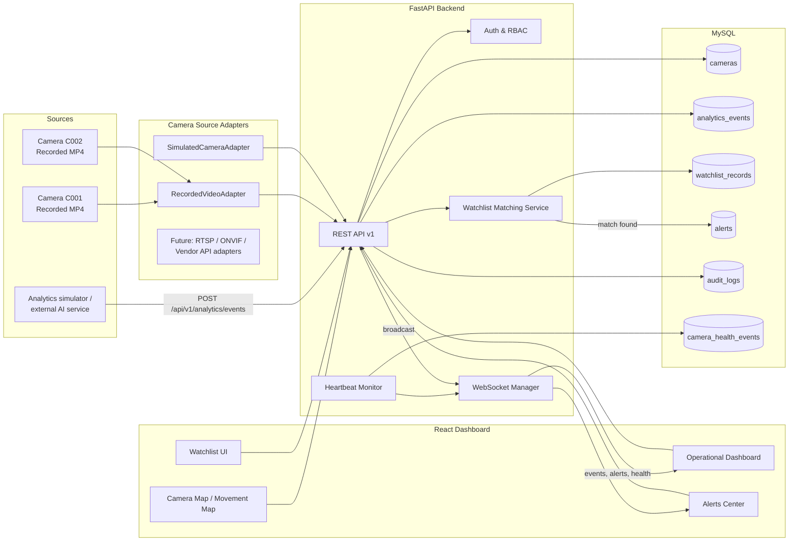

# Architecture

## 1. Overview

This prototype demonstrates the full request path required by the
assignment: camera sources → source adapters → ingestion API → database →
watchlist correlation → alert generation → WebSocket broadcast → operator
dashboard → GIS/movement visualization → audit trail.

## 2. Core demonstration flow

This is the single flow the assignment identifies as the strongest
demonstration, and it is what `POST /api/v1/analytics/events` implements
end-to-end in one transaction-safe request:

1. An analytics event (e.g. ANPR detection) arrives at the ingestion API.
2. The backend authenticates and authorizes the caller.
3. The payload is validated (camera exists & enabled, event type, confidence
   range, bounding box shape, identifier required for ANPR).
4. The `idempotency_key` is checked against `analytics_events` to reject
   duplicates.
5. The event is persisted.
6. The event is broadcast over WebSocket (`analytics_event`).
7. If the event carries an entity identifier, it is normalized and matched
   against **active** `watchlist_records`.
8. On a match, an `alerts` row is created, linked to both the watchlist
   record and the triggering event (`analytics_event_id` is unique, so one
   event can never generate two alerts).
9. The alert is broadcast over WebSocket (`watchlist_match`, `new_alert`).
10. The operator dashboard updates without a page refresh; the operator can
    acknowledge/resolve the alert, which is itself audit-logged and
    broadcast.

## 3. Source adapter architecture

`app/adapters/camera_adapters.py` defines `CameraSourceAdapter`, an abstract
base with a uniform interface (`get_stream_info()`, `check_health()`)
implemented by:

- `RecordedVideoAdapter` — serves a pre-recorded MP4 as the "feed". Labeled
  as recorded footage everywhere in the UI; never presented as live.
- `SimulatedCameraAdapter` — no real video; used to demonstrate
  registry/health/analytics without a video file.
- `RTSPAdapter`, `ONVIFAdapter`, `VendorAPIAdapter` — documented stubs that
  raise `NotImplementedError`. They exist so the contract a real integration
  must satisfy is explicit, without pretending a live connection exists when
  it does not.

Because every adapter returns the same `StreamInfo` shape, the API and
frontend do not need to know which transport a camera uses — swapping in a
real RTSP adapter later requires no change to the ingestion, matching,
alerting, or dashboard code.

## 4. Real-time architecture

A single `ConnectionManager` (`app/websocket/manager.py`) tracks active
WebSocket connections on `/ws/dashboard` (token-authenticated via query
param at connect time). Every state-changing operation that matters to an
operator — new analytics events, watchlist matches, new alerts, camera
health transitions, acknowledgements, resolutions — broadcasts a typed JSON
message (`{type, data}`) to all connected clients. The frontend
(`useDashboardSocket` hook) reconnects with exponential backoff on drop, so
a disconnected operator does not lose data — everything is persisted in
MySQL first and broadcast second, and the dashboard re-fetches on
reconnect/relevant events rather than relying solely on the socket for
state.

## 5. Security model

- JWT bearer tokens (`python-jose`), 60-minute expiry by default.
- Passwords hashed with bcrypt (via passlib).
- Role-based authorization enforced **server-side** on every mutating
  endpoint via FastAPI dependencies (`require_role("admin")`), not just
  hidden in the UI.
- CORS restricted to configured origins (`CORS_ORIGINS` env var).
- Stream references are stored but never include embedded credentials in
  this prototype; the field is documented as the place a production system
  would instead store a reference to a secrets-manager entry.
- All admin-sensitive actions are audit-logged with actor, action, resource,
  and result — but never with secrets/passwords/tokens.

## 6. What is intentionally not implemented

- Real RTSP/ONVIF/vendor camera connections (documented stubs only).
- Low-latency/live streaming — recorded MP4 playback only.
- Fuzzy/partial identifier matching — exact-match only, to avoid false
  positives (see `app/services/matching.py`).
- Cross-camera re-identification, route inference between non-adjacent
  detections, and other "Optional Features" from the assignment.
