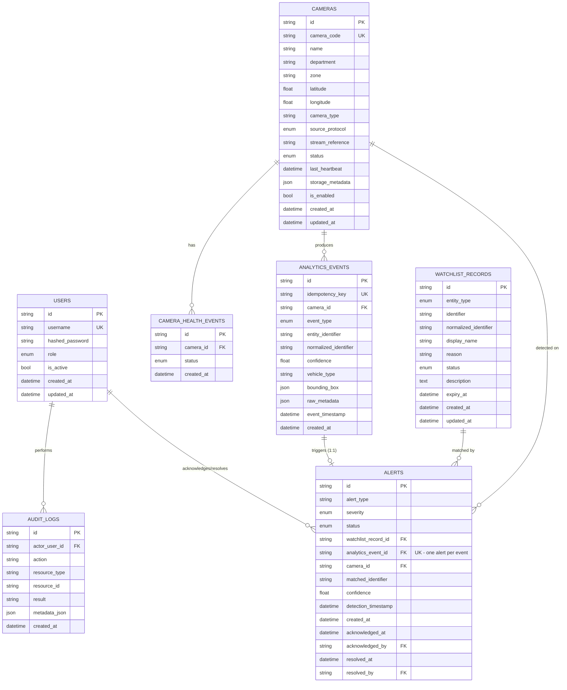

# Database Schema

Engine: MySQL 8.0 (via SQLAlchemy 2.0 + Alembic migrations in `backend/migrations/`).

## ER Diagram



## Key design decisions

- **UUID primary keys** (`String(36)`) rather than auto-increment integers,
  so IDs are safe to generate client-side/at ingestion time and don't leak
  row counts.
- **`idempotency_key` unique constraint** on `analytics_events` is the
  primary duplicate-event defense; a second insert with the same key fails
  at the database layer even under concurrent requests, not just at the
  application-validation layer.
- **`analytics_event_id` unique constraint** on `alerts` guarantees one
  triggering event can never generate more than one alert.
- **`normalized_identifier`** columns exist alongside the raw `identifier`
  on both `watchlist_records` and `analytics_events` so matching is a plain
  indexed equality lookup, not a runtime string-transform scan.
- **Composite unique constraint** `(normalized_identifier, entity_type)` on
  `watchlist_records` prevents duplicate watchlist entries for the same
  entity/identifier pair while still allowing the same plate to appear under
  different entity types if that's ever a legitimate need.
- **No hard deletes** are exposed via the API for cameras, events, alerts, or
  audit logs — only `enable`/`disable` and status transitions — so
  historical/evidentiary data is never silently destroyed. `ON DELETE
  CASCADE` is only used for `camera_health_events`, a purely derived health
  timeline.
- **Indexes**: `camera_code`, `status`, `department`, `zone` (camera
  registry filtering); `idempotency_key`, `camera_id`, `normalized_identifier`,
  `event_timestamp` (event ingestion + movement history queries); `status`,
  `created_at` on alerts (dashboard queries); `normalized_identifier` on
  watchlist (matching).

## Migrations

Managed with Alembic (`backend/migrations/`). The single initial migration
(`0001_initial_schema.py`) creates all tables listed above. Run with:

```bash
cd backend
alembic upgrade head
```

## Seed data

`backend/seed.py` creates: an admin and operator user, two cameras (distinct
locations/protocols), one active watchlist record, three detections of the
watchlisted plate across both cameras (populating movement history), one
non-matching detection, and three alerts in different lifecycle states
(new/acknowledged/resolved). See `README.md` for how to run it.
